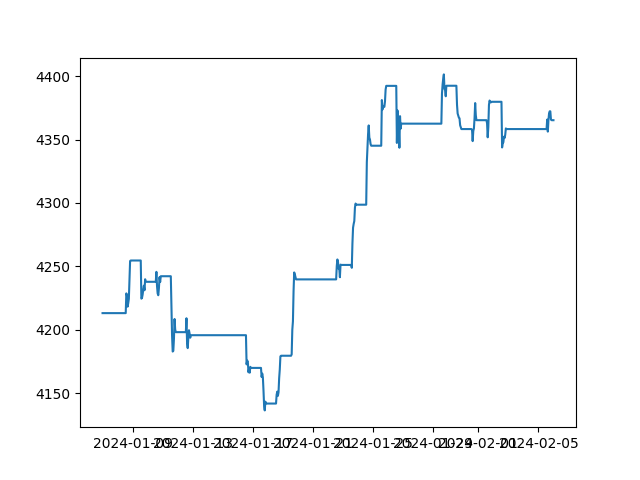

Accounts
========

An account object contains information about a specific Tastytrade account. It can be used to place trades, monitor profit/loss, and analyze positions.

The easiest way to get an account is to grab all accounts associated with a specific session:

.. code-block:: python

   from tastytrade import Account
   accounts = Account.get_accounts(session)

You can also get a specific account by its unique ID:

.. code-block:: python

   account = Account.get_account(session, '5WX01234')

The ``get_balances`` function can be used to obtain information about the current buying power and cash balance:

.. code-block:: python

   balance = account.get_balances(session)
   print(balance)

>>> AccountBalance(account_number='5WX01234', cash_balance=Decimal('87.055'), long_equity_value=Decimal('4046.05'), short_equity_value=Decimal('0.0'), long_derivative_value=Decimal('0.0'), short_derivative_value=Decimal('0.0'), long_futures_value=Decimal('0.0'), short_futures_value=Decimal('0.0'), long_futures_derivative_value=Decimal('0.0'), short_futures_derivative_value=Decimal('0.0'), long_margineable_value=Decimal('0.0'), short_margineable_value=Decimal('0.0'), margin_equity=Decimal('4133.105'), equity_buying_power=Decimal('87.055'), derivative_buying_power=Decimal('87.055'), day_trading_buying_power=Decimal('0.0'), futures_margin_requirement=Decimal('0.0'), available_trading_funds=Decimal('0.0'), maintenance_requirement=Decimal('4048.85'), maintenance_call_value=Decimal('0.0'), reg_t_call_value=Decimal('0.0'), day_trading_call_value=Decimal('0.0'), day_equity_call_value=Decimal('0.0'), net_liquidating_value=Decimal('4133.105'), cash_available_to_withdraw=Decimal('87.06'), day_trade_excess=Decimal('87.06'), pending_cash=Decimal('0.0'), pending_cash_effect=<PriceEffect.NONE: 'None'>, long_cryptocurrency_value=Decimal('0.0'), short_cryptocurrency_value=Decimal('0.0'), cryptocurrency_margin_requirement=Decimal('0.0'), unsettled_cryptocurrency_fiat_amount=Decimal('0.0'), unsettled_cryptocurrency_fiat_effect=<PriceEffect.NONE: 'None'>, closed_loop_available_balance=Decimal('87.06'), equity_offering_margin_requirement=Decimal('0.0'), long_bond_value=Decimal('0.0'), bond_margin_requirement=Decimal('0.0'), snapshot_date=datetime.date(2023, 11, 28), reg_t_margin_requirement=Decimal('4048.85'), futures_overnight_margin_requirement=Decimal('0.0'), futures_intraday_margin_requirement=Decimal('0.0'), maintenance_excess=Decimal('87.055'), pending_margin_interest=Decimal('0.0'), effective_cryptocurrency_buying_power=Decimal('87.055'), updated_at=datetime.datetime(2023, 11, 28, 20, 54, 33, 556000, tzinfo=datetime.timezone.utc), apex_starting_day_margin_equity=None, buying_power_adjustment=None, buying_power_adjustment_effect=None, time_of_day=None)

To obtain information about current positions:

.. code-block:: python

   positions = account.get_positions(session)
   print(positions[0])

>>> CurrentPosition(account_number='5WX01234', symbol='BRK/B', instrument_type=<InstrumentType.EQUITY: 'Equity'>, underlying_symbol='BRK/B', quantity=Decimal('10'), quantity_direction='Long', close_price=Decimal('361.34'), average_open_price=Decimal('339.63'), multiplier=1, cost_effect='Credit', is_suppressed=False, is_frozen=False, realized_day_gain=Decimal('18.5'), realized_today=Decimal('279.15'), created_at=datetime.datetime(2023, 3, 31, 14, 35, 40, 138000, tzinfo=datetime.timezone.utc), updated_at=datetime.datetime(2023, 8, 10, 15, 42, 7, 482000, tzinfo=datetime.timezone.utc), mark=None, mark_price=None, restricted_quantity=Decimal('0'), expires_at=None, fixing_price=None, deliverable_type=None, average_yearly_market_close_price=Decimal('339.63'), average_daily_market_close_price=Decimal('361.34'), realized_day_gain_effect=<PriceEffect.CREDIT: 'Credit'>, realized_day_gain_date=datetime.date(2023, 8, 10), realized_today_effect=<PriceEffect.CREDIT: 'Credit'>, realized_today_date=datetime.date(2023, 8, 10))

To fetch a list of past transactions:

.. code-block:: python

   history = account.get_history(session, start_date=date(2024, 1, 1))
   print(history[-1])

>>> Transaction(id=280070508, account_number='5WX01234', transaction_type='Trade', transaction_sub_type='Sell to Close', description='Sold 10 BRK/B @ 384.04', executed_at=datetime.datetime(2024, 1, 26, 15, 51, 53, 685000, tzinfo=datetime.timezone.utc), transaction_date=datetime.date(2024, 1, 26), value=Decimal('3840.4'), value_effect=<PriceEffect.CREDIT: 'Credit'>, net_value=Decimal('3840.35'), net_value_effect=<PriceEffect.CREDIT: 'Credit'>, is_estimated_fee=True, symbol='BRK/B', instrument_type=<InstrumentType.EQUITY: 'Equity'>, underlying_symbol='BRK/B', action='Sell to Close', quantity=Decimal('10.0'), price=Decimal('384.04'), regulatory_fees=Decimal('0.042'), regulatory_fees_effect=<PriceEffect.DEBIT: 'Debit'>, clearing_fees=Decimal('0.008'), clearing_fees_effect=<PriceEffect.DEBIT: 'Debit'>, commission=Decimal('0.0'), commission_effect=<PriceEffect.NONE: 'None'>, proprietary_index_option_fees=Decimal('0.0'), proprietary_index_option_fees_effect=<PriceEffect.NONE: 'None'>, ext_exchange_order_number='12271026815307', ext_global_order_number=2857, ext_group_id='0', ext_group_fill_id='0', ext_exec_id='0', exec_id='123_40126000126350300000', exchange='JNS', order_id=305250635, exchange_affiliation_identifier='', leg_count=1, destination_venue='JANE_STREET_EQUITIES_A', other_charge=None, other_charge_effect=None, other_charge_description=None, reverses_id=None, cost_basis_reconciliation_date=None, lots=None, agency_price=None, principal_price=None)

We can also view portfolio P/L over time (and even plot it!):

.. code-block:: python

   import matplotlib.pyplot as plt
   nl = account.get_net_liquidating_value_history(session, time_back='1m')  # past 1 month
   plt.plot([n.time for n in nl], [n.close for n in nl])
   plt.show()

Accounts are needed to place, replace, and delete orders. See more in :doc:`Orders <orders>`.

There are many more things you can do with an ``Account`` object--check out the SDK Reference section!